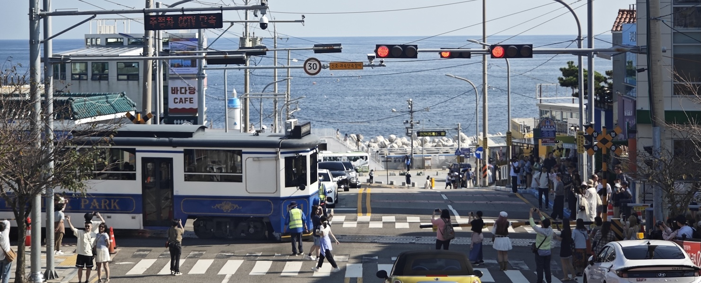

[English](README.md) | [中文](README_zh.md)

釜山最出名的景点之一是胶囊小火车。胶囊小火车在海云台蓝线公园（blue line park; <https://www.bluelinepark.com>）。蓝线公园除了胶囊小火车（天空胶囊；sky capsule）还有复古大火车（海滨列车；beach train）。海滨列车有7个车站，分别是：

A. 미포 Mipo 尾浦  
这里连接着海云台区的市中心，在海云台沙滩的东端。尾浦站也是胶囊小火车的车站。

B. 달맞이터널 Dalmaji Tunnel 迎月隧道  
是一条很短的隧道，有一段依山而建的栈道。

C. 해월전망대 Haeworl Skywalk 海月瞭望台  
是一个白色的伸向大海的天桥，尽头有圆形玻璃栈道。

D. 청사포 Cheongsapo 青沙浦  
青沙浦站是一个枢纽站，可换乘胶囊小火车。站旁有一个铁路与公路的平交道口，因海滨列车出没，形似日本镰仓的网红打卡地，因此也成为网红打卡地。

E. 다릿돌전망대 Daritdol Skywalk 桥石展望台  
是一个蓝色的伸向大海的天桥。

F. 구덕포 Gudeokpo 九德浦  
是一个海滨小镇，在松亭沙滩的西端。

G. 송정 Songjeong 松亭  
是另一片建成区，依松亭沙滩而建。

海滨列车的车票分为一次票、两次票和套票，分别可以在任意一个、两个和全部7个车站各上车一次。上车后可以乘坐任意方向的列车，在任意车站下车，但是到终点站（尾浦和松亭）时必须下车。

我们买了套票，从尾浦开始往松亭，在每站都下车走一走，到松亭后再一口气返回尾浦，也就是坐了一个来回。但是如果改变一下乘车方式，其实可以乘坐更多来回。我把它总结成这样一个问题：

> 有一条铁路，上面有七座火车站，依次是ABCDEFG。在两头的A和G站是终点站。这条铁路的两个方向都有站站停的列车。这条铁路有一个套票，这个套票在可以在全线7个车站分别上且只上一次车。除了终点站，在某个车站上车后可以乘坐任意方向的列车。上车后可以在任意车站下车，但是列车抵达两端的终点站A和G站时全部乘客都要下车。我们把相邻两站之间的一段路叫做一个区间。如果我买了这个套票，要怎么乘坐才能使得我乘坐过的区间数最大？重复乘坐的区间要累计统计。在这个乘坐方案中，我在一座车站下车后也可以步行到另一座车站上车，但每次最多步行x个区间。如果有多个乘坐区间数最大的方案，要选取总步行区间数最小的那个。请分别计算 x = 0, 1, 2, 3 时的最佳乘坐方案和最大乘坐区间数。

如果我不怕走路，无论在哪站下车都能走到另一个车站上车，那么在每个车站上车后都能乘坐从该车站出发所能走过的最大距离，也就是从该车站出发，到离它最远的终点站下车。这样一来，从A-G站出发，分别能乘坐6、5、4、3、4、5、6个区间，总共33个区间，也就是2.75个来回。这是使用套票能够乘坐的最大区间数，但是最大步行3个区间（即 x = 3），也就是从终点站返回D青沙浦站。这种情况下一个样例方案是：坐车A->G，坐车G->A，步行A->B，坐车B->G，步行G->F，坐车F->A，步行A->C，坐车C->G，步行G->E，坐车E->A，步行A->D，坐车D->G。

但是，如果我一开始从D青沙浦站出发，之后就不需要再返回青沙浦站坐车。此时最大步行2个区间（即 x = 2），也就是从终点站步行至C海月瞭望台和E桥石展望台站，也可以实现从每个车站出发，到离它最远的终点站下车。最大乘坐区间数也是33。这种情况下一个样例方案是：坐车D->A，坐车A->G，坐车G->A，步行A->B，坐车B->G，步行G->F，坐车F->A，步行A->C，坐车C->G，步行G->E，坐车E->A。

另一方面，如果我不想走路，在哪站下车就要再在哪站上车（即 x = 0）。一个试探性的方案是：坐车A->G->B->F->C->E->D->G，这样乘坐24个区间。这个路线画出来大概是一个阻尼振荡的模式。观察这个路线发现，由于“不走路”的限制，一般一个车站会有一次上车和一次下车，除了出发的车站和终到的车站。对于终到的车站，实际上是可以自由选择而不受“不走路”的条件限制的，所以一般会选择A尾浦站或G松亭站。对于出发的车站，它的一个特点就是不受“必须在这站下车一次”的限制。那么在哪站下车是最不划算的呢？是最中间的D青沙浦站。既然如此，我们不妨就让青沙浦站成为出发的车站，这样就不必在青沙浦站下车。这种情况下一个样例方案是：坐车D->G->A->F->B->E->C->G，这样乘坐27个区间。之后又试验几次发现，只要确定了出发站，中间的车站怎么变似乎对最大乘坐区间数没有影响。

这个乘坐27个区间（2.25个来回）的方案是最佳方案吗？我把这个问题向AI提问，很多AI给出的 x = 0 条件下的最大乘坐区间都没有达到27。很多是24，也有很多没有正确理解题意。我又要求AI写程序来解决这个问题，它（Gemini 2.5 Pro）写出了一个用递归函数进行暴力搜索的程序，并称其时间复杂度为O(2ⁿn³)，空间复杂度为O(2ⁿn²)。

`beachtrain_zh.py`是程序，`solution_zh.txt`是程序运行的结果。
